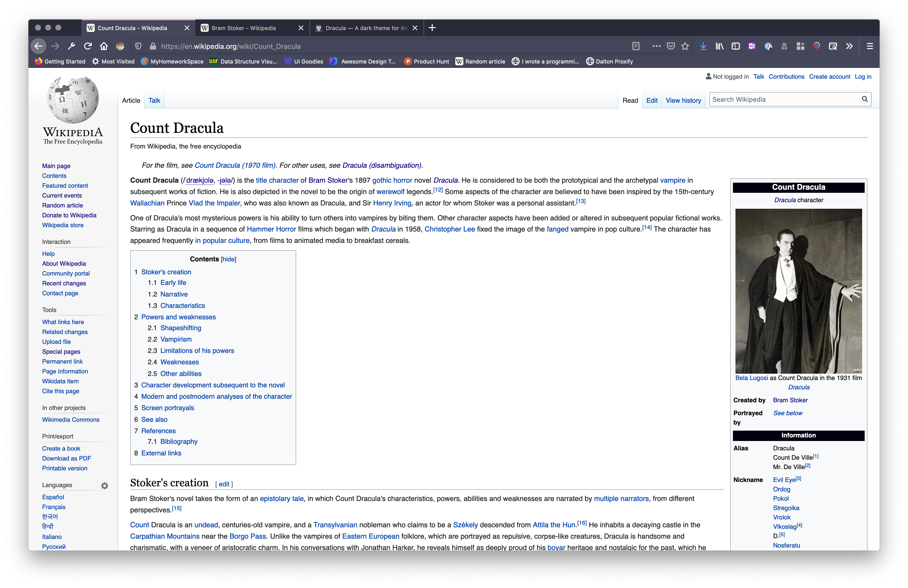

# Dracula for [Firefox](http://firefox.com)

> A dark theme for [Firefox](http://firefox.com).

## Install

All instructions can be found at [draculatheme.com/x](https://draculatheme.com/x).

## Team

This theme is maintained by the following person(s) and a bunch of [awesome contributors](https://github.com/dracula/template/graphs/contributors).

|  |
| --- |
| [Will Barkoff](https://github.com/nesl247) |
## License

[MIT License](./LICENSE)